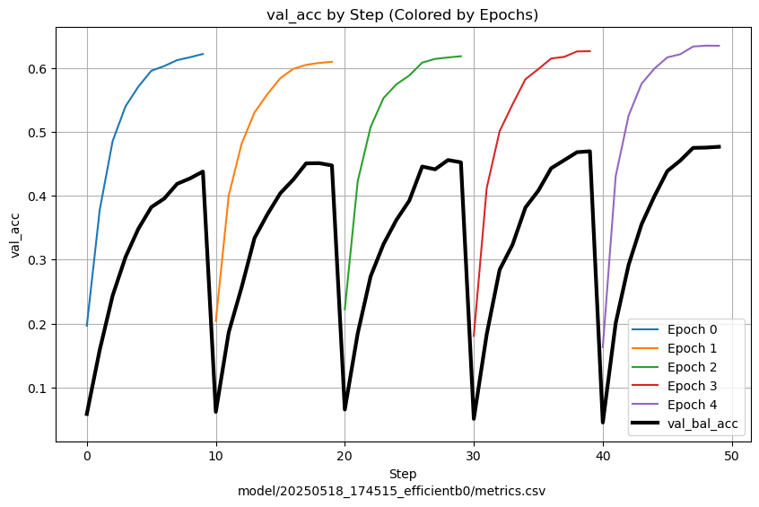

# Evaluating CNN performance on birdCLEF 2025

  Mobile and habitat-diverse animal species are valuable indicators of biodiversity change, as shifts in their population signal the success or failure of ecological restoration efforts. Conducting "on the ground" biodiversity surveys is costly and logistically demanding, so conservation campaigns have opted for autonomous recording units to record audio data in the field. Through modern machine learning techniques, these audio samples can be processed and analyzed to better understand the restoration effort's impact on local biodiversity. In this investigation, we tackled the BirdCLEF 2025 sound recognition strategy by building a classifier to detect bird calls in complex, multi-label audio recordings. Our approach integrated audio preprocessing with various implementations of convolutional neural networks (CNN), training on log-mel spectrograms, as well as using semi-supervised learning. We mitigated noise and class imbalance through label smoothing and data augmentation, and concluded our investigation by evaluating our methodology and final model performances, submitting our final models for evaluation in the competition scoreboard.

<table>
  <tr>
    <td align="center">
       
      Train spectrogram with k-means clusters
    </td>
    <td align="center">
       
      EfficientNet loss vs accuracy
    </td>
    <td align="center">
       
      EfficientNet-B accuracy across K-folds
    </td>
  </tr>
</table>

# Conclusion

This study investigated machine learning approaches for species classification in the BirdCLEF2025 challenge, evaluating the difficulties of extreme class imbalance and limited labeled data. While clustering proved ineffective for segmentation, we compared MelCNN and EfficientNetB0 architectures, finding the latter significantly more effective. Attempts to refine the dataset and incorporate soft labels did not yield consistent improvements. As a successive step, we implemented semi-supervised learning, adding pseudo-labels to the unlabeled soundscape data and continuing training of a model for a different number of times and data augmentation for underrepresented labels. Despite these efforts, we failed to improve performance beyond the baseline, with our best model achieving 0.781 accuracy on the Kaggle scoreboard. While we did not surpass state-of-the-art performance, this comprehensive analysis provides insights into the challenges of ecological audio classification and demonstrates that traditional techniques may not transfer effectively to highly imbalanced ecological datasets, suggesting future research should focus on few-shot learning and domain-specific methods tailored to biodiversity monitoring applications.
