# Abstract
Mobile and habitat-diverse animal species are valuable indicators of biodiversity change, as shifts in their population dynamics can signal the success or failure of ecological restoration efforts. Conducting "on the ground" biodiversity surveys is costly and logistically demanding, so conservation campaigns have opted for autonomous recording units to record audio data in the field. Through modern machine learning techniques, these audio samples can be processed and analyzed to better understand the restoration effort's impact on local biodiversity. The Cornell Lab of Ornithology has directed a yearly challenge to develop computational methods to process the continuous audio data and identify species across different taxonomic groups. The Lab provides labeled data to aid in the classification task: the samples from birdCLEF 2025 were recorded in the Middle Magdalena Valley of Colombia, home to a diverse variety of under-studied species. The limited amount of labeled training data among the samples presents a significant challenge for species recognition. Moreover, any classifier model must fit within select computational constraints, defined by the Laboratory. In this study, we compared the effectiveness of different model architectures, building a pipeline that reduces the audio samples to their Mel Spectrograms (Mel) and classifies them. We proceed by first exploring the properties of the dataset and segmenting the audios with a clustering algorithm. We then tackle the classification task by first studying the performance of different architectures: we study variations of a Convolutional Neural Network (CNN) architecture for their efficiency. Finally, we compare our results to a State of The Art model and we attempt to improve its performance through semi-supervised learning. We conclude by evaluating our methodology and model performance, and we submit our final model for evaluation on the competition scoreboard.

# Introduction 

## Description of the Task
In this project we compared the performance of different architectures at the BirdCLEF2025 Kaggle competition, hosted by the Cornell Lab of Ornithology. In the description of the competition, the following goals are listed: 

(1) Identify species of different taxonomic groups in the Middle Magdalena Valley of Colombia/El Silencio Natural Reserve in soundscape data.

(2) Train machine learning models with very limited amounts of training samples for rare and endangered species.

(3) Enhance machine learning models with unlabeled data for improving detection/classification.

In practice, the Lab supplies labeled audio clips originating from three different collection of species audio: *iNaturalist*, *Xeno-Canto* and the *Colombian Sound Archive*. The audios contained various animal species, ranging from four different classes, Insecta, Amphibia, Mammalia, and Aves. In addition to this, a few unlabeled Soundscapes were also provided to be used for unsupervised learning. The final objective is to develop a model capable of analyzing unseen Soundscapes to accurately detect and classify the species within.

## Limitations on the final model

As defined by the _Cornell Lab of Ornithology_, the final result of the study is a classifier model, in the format of a Jupyter Notebook, complying to the following restrictions:
- CPU Notebook: must run in less than 90 minutes.
- GPU Notebook: disabled (strict limit of 1 minute runtime)
- Internet access is disabled
- Freely & publicly available external data is allowed, which includes pre-trained models.

For the investigation, we did not include external data sources. Finally, the final performance of the model is evaluated with 5-second-long samples. With this, we split samples into **5 sec** intervals and use model architectures that are hardcoded to this size.

# Exploratory Data Analysis

We began by exploring the structure and statistical properties of the data and its labels, to inform our choice of classification models. We also explore the data source and highlight some challenges that come with it. 

## Dataset Structure

The audio data consisted of `.ogg` files alongside metadata in a corresponding `.csv` file. The main source of species information was found in the `taxonomy.csv` file, where the primary label name was linked to the animals common name, scientific name, and the animal class they belong to. 

The labeled trainig samples were placed in the `train_audio` folder, where each species had a dedicated subfolder named after ids ID, containing all corresponding audio clips. This data was described by the `train.csv`, that provided key metrics on each recording, such as the source, recording location, primary label, and some secondary additional labels of species heard in the audio, though with lower reliability.

Finally, the soundscapes were in the `train_soundscapes` folder and labeled by date and ID. Each soundscapes was exactly a minute long, while the audio samples had variable length. All audio files metrics had been normalized to fit the same range: 72 bitrate, 32000 sample rate, 1 channel and _vorbis_ as audio codec.

## Audio Durations

The _labeled_ dataset is composed of '28564' audio files, totalling '280' hours of audio, whereas the _soundscape_ '9726' for a total of '162' hours.

```
|                       | labeled | Unlabeled |
|-----------------------+----------+------------|
| Mean                  | 35s      | 60 s       |
| Number of Samples     | 28,564   | 9,726      |
| Modal Duration (10 s) | 0–10s    | 60s        |
| Total Duration        | 280h     | 162.1 h    |
```

It should be noted that although labeled data is larger in sum, there is (relatively) few usable samples, due to the vast number of labels and many labeled audio clips containing just a few seconds of relevant sound, followed by the spoken description of the recording setup and specifications: a minute-long recording may provide as little as 5 seconds of relevant audio.

Although at that stage we could not infer what portion of the dataset was actually of use, we showed the histogram of duration, comparing frequency to audio duration. Notably, frequency had to be rescaled on a log scale, and although the vast majority of the audio samples were short (64% of recordings were shorter than 30 seconds), some outliers were present (25 and 29 minutes long).

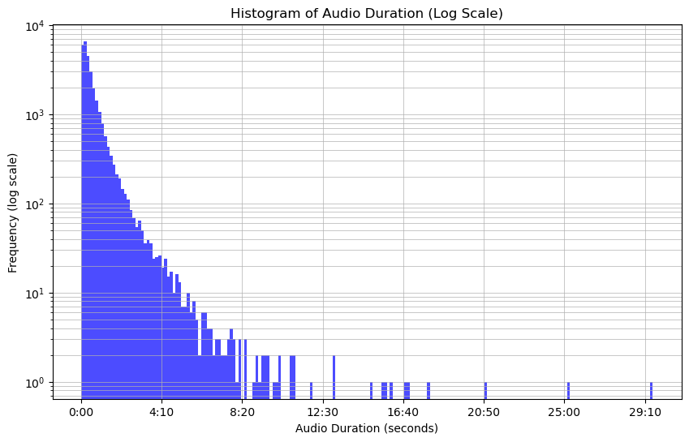

## Label Distribution

The main labels of focus are the 'primary' labels which are unique. All the clips also have a 'secondary' column which can either be empty or hold a list of other species heard in the recording. Finally, the 'type' column, if present, describes the type of bird call recorded.

We consider the distribution of primary labels in the dataset: we immediately notice an inverse relation between label presence and label rank.
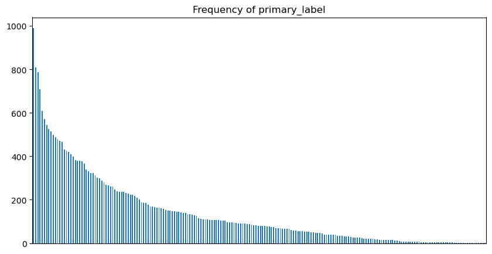

Moreover, most secondary labels are empty. This is apparent in the following sand graph: each column represents a primary label, and the pile of colors shows how many of each secondary label are present, in the recordings with the given primary label value. Notably, most secondary labels are empty, as can be seen in the large uniform area.

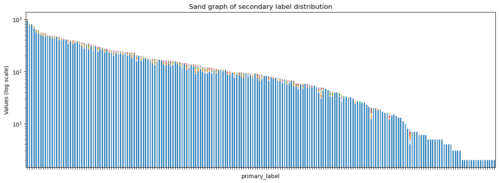

Discarding the empty secondary label, we observed more closely the richness in variety: these are few secondary labels, distributed among various primary labels. 

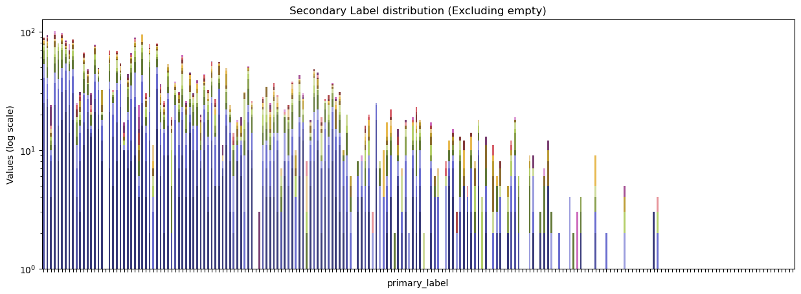

The final column of classification information, 'type', specifies a list of qualitative descriptions of the results: although most frequent labels are, in the following order: _song_, _no type_, _call_, _flight call_ and _alarm call_, there is a rich variety of calls, with 587 unique descriptors.

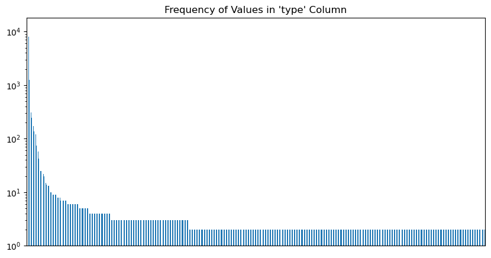

## Data Sources

Our dataset consisted of audio recordings from three different sources: Xeno-Canto, a global bird sound repository; iNaturalist, a citizen science platform with diverse wildlife recordings; and the Colombian Sound Archive, a national collection preserving Colombia’s acoustic biodiversity. These sources vary in their level of scientific rigor, some are curated by experts, while others are maintained by hobbyists. Due to this, we quickly identified several data quality challenges:

- Inconsistent availability of quality ratings across sources (only Xeno-Canto provided ratings)
- High variability in audio quality, affecting model performance
- Frequent presence of silence, background noise, and irrelevant sounds in recordings
- Risk of losing representation for rare species during data cleaning or filtering
- Severe class imbalance

## Challenges with the Data

Some audio samples in the labeled dataset are spliced with human voices explaining the microphone setup. Moreover, some audio recordings contained large proportions of static noise, with no relevant information in those cases.

The labeled recordings are characterized with an extreme degree of class imbalance in training data, with the least catalogued classes being composed of less than a minute samples in total. For instance, the following table shows the tail of the dataset classes, with the least represented labels.

```
| primary_label | Tot    |
|---------------+--------|
|         81930 | 44 sec |
|         67082 | 44 sec |
|        548639 | 29 sec |
|         66016 | 26 sec |
|        523060 | 24 sec |
|        868458 | 23 sec |
|         42113 | 22 sec |
|         42087 | 21 sec |
|         21116 | 13 sec |
|       1564122 | 11 sec |
```

Though the audio recordings were labeled by a reliable 'primary_label' feature, we also have access to a less reliable set of secondary labels. This motivated a consideration of different levels of trustworthiness for this secondary labels, which we explored through the use of an m parameter, obtaining a wide range of performance.

Unlabeled recordings: almost half of the dataset is unlabeled, all with same length, which may give more information on the characteristics of audio data, but does not provide additional information through labelling.

# Audio Preprocessing

To make the analysis more computationally tractable, we experimented with transformations to reduce the raw audio into spectrogram-based representations. Two wdiely used methods for this are the Mel spectrogram and the Mel-Frequency Cepstral Coefficients (MFCCs).

The Mel spectrogram applies a Mel filter bank to a short-time Fourier transform (STFT), mapping frequencies to the Mel scale, defined in terms of perceived pitch and modeled after human auditory perception.

In contrast, MFCCs are a compact representation derived by applying a Discrete Cosine Transform (DCT) to the log-Mel spectrogram. This process reduced dimensionality and emphasized the most informative features for tasks like speech and speaker recognition.

Compared to raw spectrograms, both Mel and MFCC representations reduce dimensionality and increase robustness to noise and variability. For the purposes of our investigation, we compared performance of models on both inputs types and found consistently better results with Mel spectrograms. Consequently, we chose the Mel spectrogram as our primary audio transformation for this study.

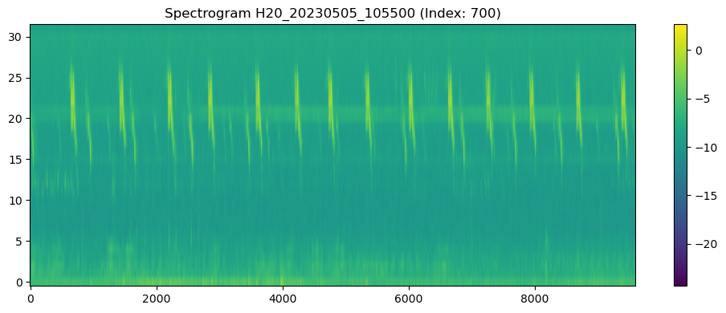

## Audio Splicing

The final classification task involves identifying bird species present within a one-minute audio recording. To achieve this, we divide the recording into smaller segments and classify the species detected in each segment. We chose a 5-second window size, meaning our model is trained on 5-second chunks of labeled data. All the recordings in the dataset were preprocessed accordingly: audio longer than 5 seconds was split into multiple segments, while recordings shorter than 5 were zero-padded. In cases of a leftover segment of at least 2.5 seconds (e.g., an 8-second recording), we include both the first and last 5-second segments, aligning the remaining audio to the end.

When training the early models, we noticed that computing the mel spectrograms of each recording on-the-fly was a major bottleneck: a CPU-intensive task that impeded training. To address this, we precomputed and cached the Mel spectrograms to disk, significantly accelerating training by avoiding repeated transformations.

## Clustering

Since labeled audios often included sources of external noise, which did not correspond to the labels, we were interested in removing the worst examples of training data to improve the quality of the dataset, in order to train a classifier model on only the best data. We approached this problem by first evaluating the performance of clustering algorithms.

We compared the performance of several clustering algorithms on normalized Mel coefficients.

- _K-means_: the simplest conceptually, performed reasonably well, though it involved the added difficulty of setting the number of clusters beforehand.
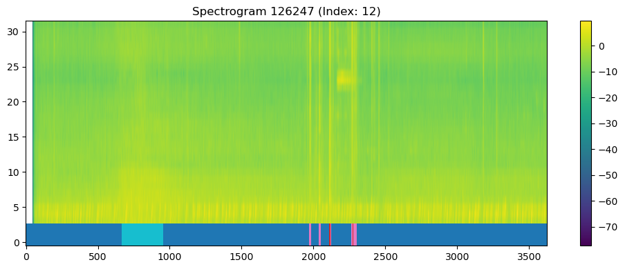
- _DBSCAN_: density-based method capable of automatically determining the number fo clusters, however, tweak epsilon and min size
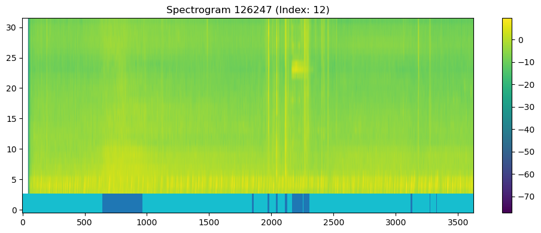
- _Agglomerative clustering_: we identified 'ward' as the best clustering rule. We attribute this to minimizing total variance within the cluster, preferring "self-contained" units.

In order to enforce wider cluster windows, we also experimented with different ways to enforce continuity of the clusters in time: first encouraging time continuity by adding the time index to the data as an additional column, and second by experimenting with enforcing it as a hardcoded constraint. In both cases, we were unable to produce distinct results that could be usable for an initial filtering.

We also applied the same clustering pipeline to MFCC, but the results were inferior.Clusters formed around audio without discernible differences, likely caused by microphone or environmnetal artifacts, rather than meaningful acoustic differences. These results further discouraged us from using MFCC in our investigation.

Additionally, we tested K-means clustering, using the primary and secondary labels as a reference for the number of clusters, including an additional cluster for 'unlabeled' samples. While parameter tuning could yield reasonable clusters in individual cases, the method's performance degraded significantly across recordings with different background conditions or device setups.

In conclusion, clustering methods were ineffective for isolating bird calls from raw audio, particularly in unlabeled data. Given their limited robustness and generalization, we moved to exploring alternative ways of extracting the animal calls, detailing our methods in the following sections.

## Rating-Based Filtering

We first leveraged the rating system available in the Xeno-Canto dataset:

- Analyzed the distribution of ratings, finding most clips rated above 3.5
- Identified that filtering out low-rated samples (< 3.5) would affect only 0.19% of the data
- Found two species (Jaguar '41970' and Spotted Foam-nest Frog '126247') that would be lost if strictly filtered by rating
- Implemented a preservation strategy by retaining the top 5 highest-rated examples of these at-risk species

This approach ensured we maintained representation across all 206 taxonomy labels while improving overall data quality.

## YAMNet Audio Classification

Since rating-based filtering only affected a small portion of our dataset, and since we wanted to better navigate the variety of nature of the spliced audio clips, we identified Google's YAMNet model, a pre-trained deep learning model for general-purpose audio classification based on the AudioSet dataset. YAMNet identifies the main category of sound in a clip out of a comprehensive list of 521 event classes, enabling us to automatically annotate and filter clips based on their primary acoustic content.

We applied YAMNet filtering with the following procedure:

1. **Segmentation**: All recordings were split into the standardized t-second clips, aligning with the input format required for our downstream models
2. **Classification**: Each segment was passed through YAMNet to obtain a predicted label from the 521 available event classes.
3. **Curated "Keep" List**: We created a whitelist, "All", of 27 relevant audio classes, including such categories as "Bird", "Animal", and other ecologically meaningful sounds, to priotize *data quality*.
4. **Curated "Remove" List**: We also created a list, "Light", to maintain *data quantity*, where a more lenient regime removed only the largest present, and most clearly irrelevant classes: "Silence", "Noise", "Vehicle".
5. **Validation**: Verified that the filtering preserved broad species representation across the dataset.

This two-stage approach allowed us to improve the quality of our data while maintaining the label diversity. The filtered dataset provides cleaner, more relevant audio segments for model training, which should improve classification performance. The standardized 5-second segments also better match our target application, where we will analyze Soundscapes using similar-length segments.

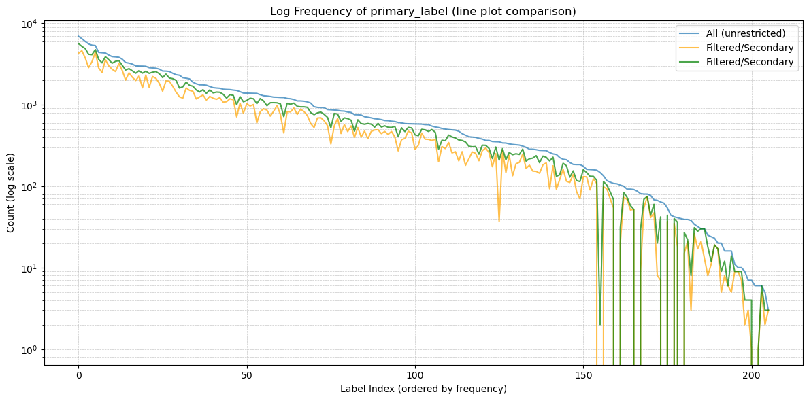

The two filtering regimes, We considered two filtering regimes: 'All', a more rigorous filtering which only maintained relevant audio classes. This filtering resulted in 67% of the original data, and the loss of just 6 label classes. The second method, 'Light', that only excluded 'Silence', 'Noise' and 'Vehicle' retained retained 83% of the samples.

## Data Augmentation

To improve generalization and robustness in our models, we applied multiple spectrogram augmentation techniques during training. We leveraged both labeled and unlabeled audio data to increase variability and mitigate class imbalance. The augmentations included:

1. **SpecAugment-based Transfomations** 
- *Time masking*: Random horizontal stripes (time axis) were zeroed to simulate occluded temporal segments.
- *Frequency masking*: Random vertical stripes (frequency axis) were zeroes to simulate missing spectral bands.
- *Random brightness and constrast adjustments*: Gain and bias varied to simulate different recording conditions, intensity clamped to a normalized [0, 1] range.

2. **Mixup Augmentation**
Input batches were augmented using the Mixup technique, where pairs of samples were linearly interpolated:
- Spectrograms were combined as x̃ = λx₁ + (1 − λ)x₂ with λ sampled from a Beta distribution.
- Targets were mixed proportionally to λ.
- The loss function was adjusted accordingly to interpolate between the two labels.

3. **Labeled-Unlabeled Interpolation**
To exploit the large pool of unlabeled data, we generated synthetic training examples by interpolating the mel spectrogram of a labeled recording with that of a uniformly sampled unlabeled clip.

## Label Smoothing

To take advantage of the information provided by the secondary labels, we modified the target label distribution used durin training. Specifically, we constructed soft target probability vectors by distributing label mass between the primary label and its associated secondary labels, controlled by a parameter $m \in [0,1]$.

We started from one-hot encoding of the primary label, taken as the basis vector $\mathbf{e}_m$, which we scaled by $m$, and to which we added the encoding vectors as the uniform probability of the secondary labels: $\frac{1-m}{\#\text{secondary labels}}$ for each possible secondary label.

We also included a 'null' label in the classifier, to account for lower confidence levels and deter 'hallucinations'. In data points without secondary labels, the leftover probability mass was placed in the 'null' label, to ensure the probability vector was consistent.

# Modelling and Experiments

We built towards the task of soft classification using models of increasing complexity, before comparing the results with a state-of-the-art solution, which we extended with data augmentation.

It should be noted that the baseline accuracy of a model that was guessing randomly, given the distribution of the data, was $\text{P}_\text{correct} = 0.012$.

We used an 80-20 train-test data split, tracking the validation Cross Entropy Loss and Accuracy metrics at the end of every epoch. For completeness, we showed the results for the EfficientNet architecture.

## MelCNN

As an initial experiment, we first studied the performance of a 'deep' CNN, with the following performance metrics: Cross Entropy Loss and Accuracy. We decided to restrict the input space to a simpler CNN architecture that used only the Mel Spectrogram. Compared to the more complex architectures tested later, MelCNN was trained for fewer epochs and without data augmentation or label smoothing. The models below explored different values for the label mixing factor $m$ and input filtering strategies.

Performance across configurations varied, but remained poor, with all accuracies below 0.05, which indicated both underfitting and limitations in model capacity. Moreover, although soft labeling ($m=0.8$) on the "All" subset slightly improved accuracy, we noticed that training on the full dataset with one-hot encoding ($m=1.0$) was more consistent in producing low accuracy (\~0.0261–0.0298), even when extended to 10 epochs.

Finally, "Animal" filtering generally performed better than "All" despite fewer training samples, likely due to cleaner or more consistent labeling.

```
| Data   | Epochs | Encoding | Accuracy | Hash     |
|--------+--------+----------+----------+----------|
| All    |     10 |      1.0 |   0.0298 | c580a9c1 |
| All    |      3 |      1.0 |   0.0261 | c580a9c1 |
| Light |      3 |      1.0 |   0.0397 | c580a9c1 |
| All    |      3 |      1.0 |   0.0261 | 5a6176d1 |
| Light |      3 |      0.8 |   0.0402 | 5a6176d1 |
```

Empirically, we decided to stop training after 3 epochs, as we saw little improvements after, probably due to limited model capacity.

After seeing the poor results of this preliminary architecture, we decided to consider a more complex model, trained for a longer time, in order to improve generalization and achieve higher accuracies.

## EfficientNet

After our limited successes with training models from scratch, we opted to try a different approach: filtering the best data and using a pre-trained model.

```
| Data   | Epochs | Encoding | Train Acc. | Hash     |
|--------+--------+----------+------------+----------|
| All    |     15 |      1.0 |      0.770 | c580a9c1 |
| Light |     15 |      1.0 |      0.760 | 9964eb55 |

```

As an initial step, we tested the model's ability to fit to the data, observing a high training accuracy (0.77 and 0.76) on both All and Light datasets with one-hot encoding (m=1.0).

Small gap between All and Light datasets suggested that both contain enough learnable patterns, and EfficientNet is robust across them.

```
| Data  | Epochs | Encoding | Accuracy | Bal Acc | Hash     |
|-------+--------+----------+----------+---------+----------|
| All   | 10     |      1.0 |    0.476 | /       | 8b600946 |
| All   | 10     |      0.8 |    0.451 | /       | 8b600946 |
| Light | 8/10   |      1.0 |    0.315 | /       | 781592e6 |
| Light | 6/10   |      0.8 |    0.266 | /       | 781592e6 |
| All   | 10     |      1.0 |   0.4983 | 0.400   | 0a242441 |
| All   | 6/10   |      0.7 |    0.343 | 0.304   | 0a242441 |
```

In the experiments, we noticed signs of overfitting: the model reached a training accuracy of about 0.77, but its evaluation accuracy on the same dataset (with hard labels, m=1.0) was significantly lower at 0.476. This gap suggests the model may be learning patterns that don't generalize well, even on familiar data.

We also tested soft labeling by adjusting the label confidence to m=0.8. Interestingly, this slightly decreased performance, dropping the evaluation accuracy to 0.451. This indicates that, at least in our setup, soft labeling may hurt performance—potentially because it introduces uncertainty or emphasizes less confident predictions, which could confuse the model.

To reduce noise in the dataset, we applied a filtering step using Light Yamnet, which resulted in a noticeable drop in accuracy compared to using the full dataset. This suggests that while filtering may reduce noise, it can also remove useful diversity that helps the model generalize better.

When we combined filtering with soft labeling, performance degraded even further. This aligns with the idea that soft supervision might not be effective when the dataset is already sparse or contains weak signals—adding uncertainty in such cases can be more harmful than helpful.

Overall, the best performance (validation accuracy = 0.4983) was achieved when using the full dataset with hard labels (m=1.0). This supports the conclusion that, for our setup, full supervision with confident labels is the most effective approach.

Finally, we found that very soft labels (m=0.7) combined with early stopping (after 6 out of 10 training epochs) led to a significant drop in both accuracy (down to 0.343) and balanced accuracy (0.304). This further highlights how sensitive the model is to supervision quality and training strategy.

Moreover, to better understand the evolution of performance, we decided to plot the evolution of loss of EfficientNet. 

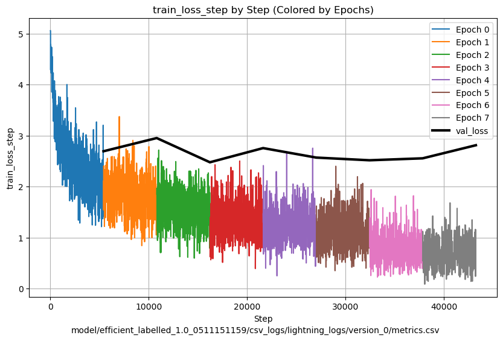

We noticed that overfitting is a true concern training with this kind of data, especially considering that the model is of size much larger than the total number of training samples.

## Semi-supervised Learning

Given the vast amounts of unlabeled audio recordings that were also present in the dataset, we attempted to use semi-supervised learning to improve the model: we first added labels to the soundscape recordings using our best performing model, before continuing to train the model on the newly generated labels. We hoped that the additional training might provide the model with more information on the distribution of the dataset, potentially improving the model’s performance.

As an additional note, we also ran the "naive" EfficientNet implementation, comparing the labelling of the two using a confusion matrix: we observed prominent vertical and horizontal streaks in the confusion matrix. This was consistent with our expectations: as the old model was biased and somewhat overfitted, we could identify in vertical lines labels that were clumped by the naive implementation but differentiated in the new model, and the opposite in the horizontal lines: uncertain labellings which belonged to a single class according to the newer model, with successively poorer performance in later epochs.

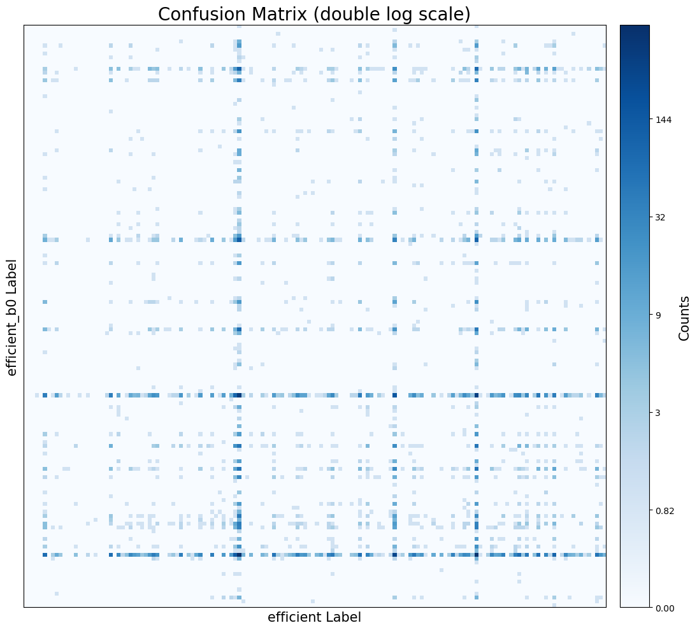

Plotting the training performance for the second stage of training, we observed more 'spikey' accuracy, which could be attributed to overfitting. Moreover, through variations of the model, we noticed that the performance generally peaked in the second fold, taking different models.

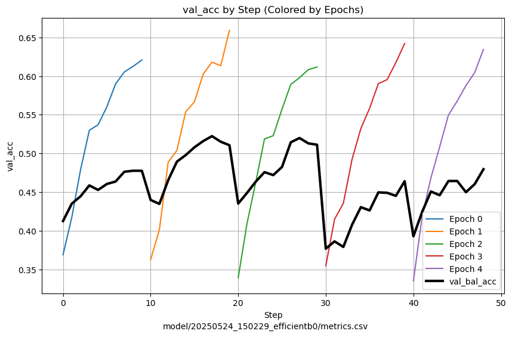


## Takeaways from the Experiments

Experimenting with different model architectures and validation methods, we tried to account for the imbalance in the training data, with varying degrees of success.

In our training experiments, we considered $\text{m}\in \{0.7, 0.8, 1.0\}$, but we always observed better results with $\text{m}=1$, that is, one-hot encoding.

A simple model like the MelCNN was not able to capture the full image of the data, which was particularly clear when observing the much higher accuracy score of the EfficientNet variation.

Given the limited amounts of data, overfitting was a real concern, which warranted the use of more sophisticated techniques to avoid it, notably Balanced Accuracy and Cross-Fold validation.

# Results Analysis

## Comparison to SOTA EfficientNet Implementation

In line with our observations on the exploratory models, we addressed shortcomings and limitations by comparing the metrics of our implementation with those of a State-Of-The-Art solution.

To address class imbalances, since some classes appear far more frequently than others, we resorted to Balanced Accuracy. This metric computes the average of recall (true positive rate) for each class, ensuring that all classes contribute equally to the final score, regardless of their frequency in the dataset.

We use the following key metrics are used to evaluate model performance: Binary Cross Entropy Loss, Balanced Accuracy, and AUC Score. Binary Cross Entropy Loss is a standard loss function for binary classification tasks that measures the distance between predicted probabilities and actual binary labels. It penalizes incorrect predictions with high confidence more heavily, encouraging the model to output calibrated probabilities. AUC Score, or Area Under the Receiver Operating Characteristic Curve, evaluates the model's ability to distinguish between classes across all possible thresholds, offering a threshold-independent view of performance.

Loss quantifies how close the predicted probability vector is to the target distribution, usually a one-hot vector for classification tasks. A lower loss indicates that the model’s predicted probabilities are better aligned with the true labels. Accuracy, on the other hand, measures how often the class with the highest predicted probability matches the actual label.

We used both metrics because loss provided a continuous signal that reflected model confidence and could guide training, even when predictions were incorrect. Accuracy, in contrast, was discrete and only measured final decision correctness.

Finally, we used cross-validation to reduce the risk of overfitting on the data during the training phase. This was also relevant in training the final, complete model on the whole dataset, as a 100-0 split would have lacked a reliable accuracy metric to decide when to stop the training.

## Results

Observing the evolution of loss throughout training, we noticed a similar phenomenon to the previous implementation of EfficientNet: the model is slow to generalize, despite the advantages of the new configuration, and the availability of the full training dataset.

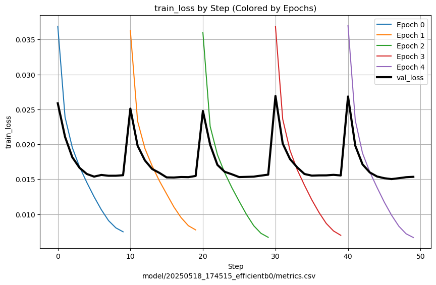

On a second note, validation accuracy fell within the previous results, though it was higher as a result of the enlarged training data. This could be attributed to K-fold cross-validation training on the whole dataset, as opposed to only 80% of it.

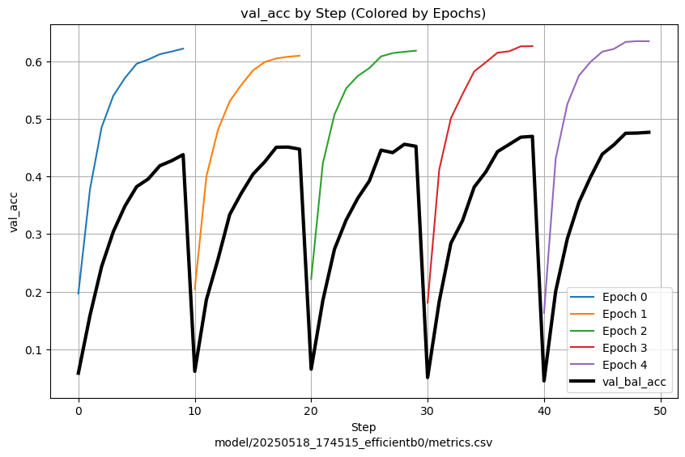

To account for the limitations of cross-validation, we also trained a model using the same regime for 90% of the dataset, validating at the end on 10% of the dataset. Plotting the confusion matrix, there is no clear 'bias' between taxonomy groups: the model performs uniformly over different labels. For reference, the new model performed with 0.78 accuracy when using the whole train dataset (hash 59672068). 

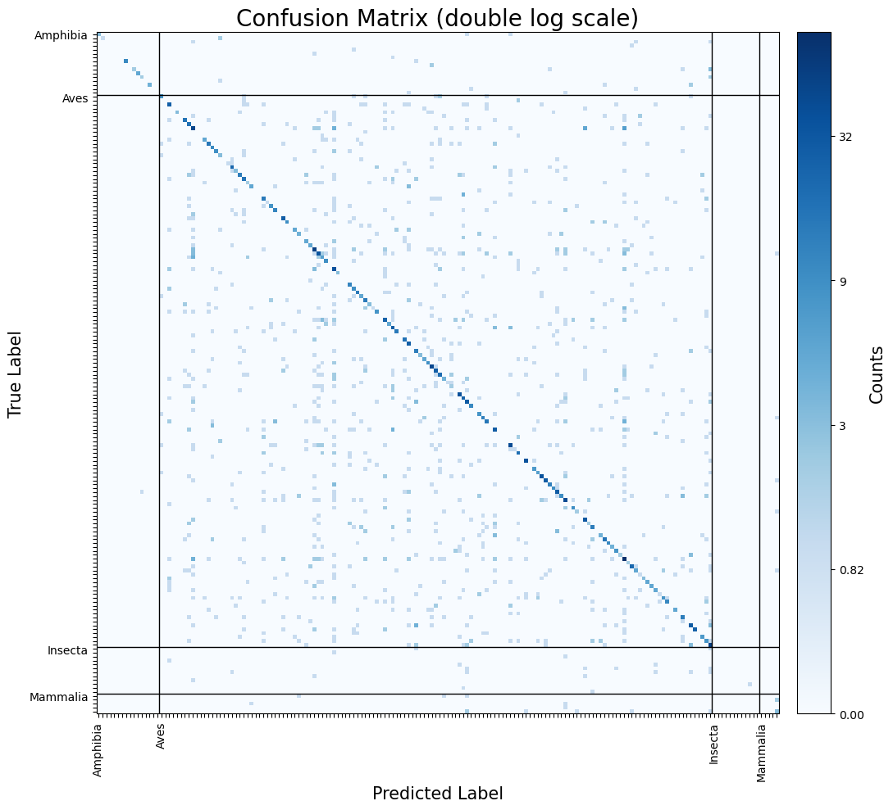

## Kaggle Scoreboard

To compare the final performance of the models, we used Kaggle's hidden test feature. We had to proceed in this way because the full model was trained on the complete dataset, leaving no validation data.

We tracked the effect of various training changes to accuracy: augmenting underrepresented classes, running Curriculum Learning with the Soundscapes and taking different stages throughout the training phase of the model. We summarized these results in the following table (hash 6f4a47ac):

```
| Soundscape | Fold | Augmentation      |       |
|------------+------+-------------------+-------|
| No         |    5 | No                | 0.781 |
| No         |    5 | Yes               | 0.500 |
| Yes        |    1 | Yes (soundscape)  | 0.728 |
| Yes        |    1 | No                | 0.725 |
| Yes        |    5 | No                | 0.717 |
```

In general, we saw worse performance when augmenting underrepresented classes. This effect was particularly obvious when training on the original train dataset. Moreover, later folds of training on the soundscape dataset performed worse.

Unfortunately, we were unsuccessful in improving the performance of the model beyond the baseline state-of-the-art model. None of the variations on the new model improved the performance. We attribute this to the dataset, which has shown itself to be extremely sensitive to changes both in training regime and in data augmentation.

# Evaluation of Methodology

The project proved to be quite challenging, as it was the most complex one we had undertaken to date. Despite trying to be pragmatic, we took some early decisions which later turned out to be impractical.

The code for the investigation was developed in Python, using a mix of Python scripts and Jupyter notebooks depending on our need for interactivity. For instance, model scripts were written as .py files, while exploratory graphs and one-time data operations were handled in interactive notebooks. Once certain notebook code matured and became reusable, we exported it into standalone scripts. Version control was managed using Git, with the repository hosted on GitHub. Overall, we were satisfied with the structure we adopted.

Regarding hardware, we performed less intensive operations on our personal laptops, while training and other data-heavy tasks were automated using shell scripts submitted to the High Performance Cluster (HPC) available through our university, _Università Commerciale Luigi Bocconi_. We relied on shell utilities for most data transfers between our local devices and the HPC, referencing results by their Git commit hash for reproducibility.

Initially, we experimented with different models and introduced flexible hyperparameter configurations to increase generality. Eventually we found ourselves developing two models (MelCNN and EfficientNet), while only being seriously interested in one of them, which consumed time that would have been better spent developing new models. In hindsight, a more solution-oriented, pragmatic approach, ie. keeping the code lighter and hardcoding more variables, would have been more effective. As a reference, framing the investigation as a hackathon, with following a "fail fast, fail often" mindset, could have accelerated our progress.

We tracked our efforts using custom time-tracking tools: the org-mode library in Emacs and Clockwork, an independently developed productivity utility. The bulk of the project was completed in approximately 100 hours, tracked over 150 commits and spanning five to six weeks.

# Conclusion

This study investigated machine learning approaches for automated species classification in the BirdCLEF 2025 challenge, evaluating how fundamental challenges of extreme class imbalance and limited labeled data influence ecological audio analysis, using data taken from Colombia's Middle Magdalena Valley. We relied on Mel spectrograms, and observed that clustering approaches are ineffective for audio segmentation, which we attributed to qualitative differences between recordings. We then studied the performance of a simple MelCNN architecture and a 'Naive' EfficientNet B0 implementation, using loss, accuracy and balanced accuracy. Using an 80-20 train-test data split, we obtained an accuracy score of approximately 0.45, and balanced accuracy of 0.30. We also attempted to filter the data to obtain a refined dataset: we used Google's Yamnet classifier to produce labels of the samples, but we achieved only marginal improvements. Instead, we observed a loss in performance when filtering the data in any way, despite preserving more than 80% of the samples and ensuring labels were preserved. We also attempted to employ secondary labels through soft labelling, but any model performed better with one-hot encoding. Finally, we compared our results with a publicly available EfficientNet B0 implementation, which substantially outperformed our custom MelCNN and naive EfficientNet architecture. The state-of-the-art solution achieving validation accuracy up to 0.498, using 90% of the training data with 5 k-folds, and a Kaggle hidden dataset score of 0.78. As a successive step, we implemented semi-supervised learning, adding pseudo-labels to the unlabeled soundscape data and continuing training of a model for a different number of times and data augmentation for underrepresented labels. Despite these efforts, we failed to improve performance beyond the baseline, with our best model achieving 0.781 accuracy on the Kaggle scoreboard. While we did not surpass state-of-the-art performance, this comprehensive analysis provides insights into the challenges of ecological audio classification and demonstrates that traditional techniques may not transfer effectively to highly imbalanced ecological datasets, suggesting future research should focus on few-shot learning and domain-specific methods tailored to biodiversity monitoring applications.

# Sources

- [BirdCLEF 2025 – Kaggle Competition](https://www.kaggle.com/competitions/birdclef-2025)
- [EfficientNet – Wikipedia](https://en.wikipedia.org/wiki/EfficientNet)
- [Curriculum Learning – Wikipedia](https://en.wikipedia.org/wiki/Curriculum_learning)
- [Mel-frequency cepstrum](https://en.wikipedia.org/wiki/Mel-frequency_cepstrum)
- [Università Commerciale Luigi Bocconi](https://www.unibocconi.it/it)
- [ClockWork by Tommaso Ferracina – GitHub](https://github.com/quercia-dev/Attimo)
- [GNU Emacs – Official Site](https://www.gnu.org/software/emacs/)
- [Doom Emacs Configuration by Tebe Nigrelli – GitHub](https://github.com/tebe-nigrelli/doomemacs-config)


# Appendix

In our investigation, we used `anaconda` as our preferred package manager. After installing conda, you can recreate the environment through the _environment.yml_ file with the command `conda env create -f environment.yml`. By activating the environment, you can run python scripts within the environment. Alternatively, the `ipykernel` package, already included in the environment, allows to run jupyter notebooks in the correct environment.

HPC (High Performance Computer) shortcuts:

- `sbatch foo.sh`: submit a job
- `squeue -u <username>`: shows the status of the job on the queue (short)
- `scontrol show job <jobID>`: shows the extended status of the job as it was running
- `scancel <jobID>`: stops the job

The also use the ssh version of the copy command to transfer files back and forth between our devices and the cluster:

```
scp -rT hpc:PRJ/birdclef2025/output/. output
scp -rT hpc:PRJ/birdclef2025/model/. model
```