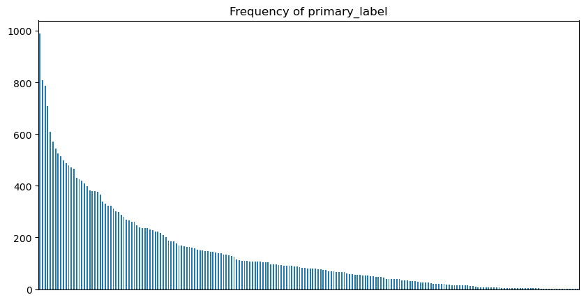

# Abstract
Mobile and habitat-diverse animal species are valuable indicators of biodiversity change, as shifts in their population dynamics can signal the success or failure of ecological restoration efforts. However, conducting "on the ground" biodiversity surveys is costly and logistically demanding. As an alternative strategy, some conservation campaigns have therefore opted to perform passive acoustic monitoring (PAM); the use of autonomous recording units to record audio data in the field. Through modern machine learning techniques, these audio samples can be processed and analyzed to better understand the restoration effort's impact on local biodiversity. The Cornell Lab of Ornithology directs a yearly challenge to develop computational methods to process the continuous audio data and identify species across different taxonomic groups. The Lab provides data to aid in the classification task: the samples from birdCLEF+ 2025 were recorded in the Middle Magdalena Valley of Colombia, home to a diverse variety of under-studied species. The limited amount of labeled training data among the samples presents a significant challenge for species recognition. Moreover, any classifier model must fit within select computational constraints, defined by the Laboratory. In this study, we analyze the audio samples through dimensional reduction techniques such as Mel-Frequency Cepstral Coefficients (MFCC), Uniform Manifold Approximation (UMAP) and Variational Autoencoders (VAE). We tackle the classification task by first studying the performance of different architectures: we consider Sound Event Detection (SED) and Convolutional Neural Networks (CNN) for their efficiency, and some data polishing techniques. We also reduce our model size through optimizations such as Knowledge distillation and int8 quantization. Finally, we combine our models to produce a best classifier through a ranking scheme. We submit our model to the official institution website.

<!---
actual techniques to be used will have to be updated as we go
-->

# Exploratory Data Analysis

We begin by exploring the structure of the data and its statistical properties, to inform our choice of classification models.

The dataset is divided between labelled (training) and unlabelled (soundscapes) data. Audio files are `.ogg` audio files which contain metadata, and a labelling `.csv` table.

In general, both labelled and unlabelled datasets are large, with labels range in quality, depending on their source.

<!---
TODO: study how audio quality metric is related to source of training data
-->

## Dataset Structure

In the labelled data, the `training.csv` table provides key metrics on each recording, such as microphone type, recording location, main label and some secondary additional labels which seem present in the audio, though with lower reliability. 

All recordings are in the `.ogg` audio file format. The samples have variable length and label quality, as they originate from different microphones.

## Audio Durations

The _labelled_ dataset is composed of '28564' audio files, totalling '' hours of audio, whereas the _soundscape_ '9726' for a total of '161' hours.

<table>
  <thead>
    <tr>
      <th></th>
      <th>Labelled</th>
      <th>Unlabelled</th>
    </tr>
  </thead>
  <tbody>
    <tr>
      <td>Mean</td>
      <td>35 s</td>
      <td>60 s</td>
    </tr>
    <tr>
      <td>Number of Samples</td>
      <td>28,564</td>
      <td>9,726</td>
    </tr>
    <tr>
      <td>Modal Duration (10 s)</td>
      <td>0–10 s</td>
      <td>60 s</td>
    </tr>
    <tr>
      <td>Total Duration</td>
      <td>280 h</td>
      <td>162.1 h</td>
    </tr>
  </tbody>
</table>

It should be noted that although labelled data is larger in sum, there is (relatively) few usable samples, since there is a high number of labels and a non-negligeable portion of the labelled data contain just a few seconds of relevant sound, followed by the spoken description of the recording setup and specifications: a minute-long recording may provide as little as 5 seconds of relevant audio.

Although at this stage we cannot infer what portion of the dataset is actually of use, we show the histogram of duration, comparing frequency to audio duration. Notably, frequency has to be rescaled on log scale, and although the vast majority of the audio samples are short, (64% of recordings are shorter than 30 seconds), some outliers are present (25 and 29 minutes long).

Unlabelled data is straightforward: all audios are of 60s length.

## File characteristics

All audio files metrics, both in labelled and unlabelled datasets, have been normalized to fit the same range: 72 bitrate, 32000 sample rate, 1 channel and _vorbis_ as audio codec.

## Label Distribution

The main labels of focus are 'primary' which is unique, 'secondary' which may be present or absent altogether, and 'type' - a qualitative indicator of the recording.

We consider the distribution of primary labels in the dataset: we immediately notice an inverse relation between label presence and label rank.

Moreover, most secondary labels are empty. This is apparent in the following sand graph: each column represents a primary label, and the pile of colors shows how many of each secondary label are present, in the recordings with the given primary label value. Notably, most secondary labels are empty, as can be seen in the large uniform area.

Discarding the empty secondary label, we observe more closely the richness in variety: are are few secondary labels, though spread between different labels. 

As an additional column of classification information, 'type' specifies for each recording
The column 'type' provides a list of qualitative descriptions of the results: the most frequent labels are, in the following order, _song_, _no type_, _call_, _flight call_ and _alarm call_, but there are 587 unique descriptors.

# Data Preprocessing

To make the analysis more computationally tractable, we experiment with reducing the audio samples using 'MEL' and 'MFCC' coefficients. 

<!---
Add explanation of the coefficients
-->

We use spectrograms to display the MEL coefficients: 

<!---
Add MFCC coefficients visualization
-->

## Clustering

For the purpose of training a classifier model, we are interested in segmenting the recordings by label: we compare the performance of different clustering algorithms on normally standardized MEL coefficients.

- K-means: the simplest conceptually, but it has to be given a number beforehand.

- Agglomerative clustering: 'ward' rule performed best vs others??
- DBSCAN: unlimited number of clusters, tweak epsilon and min size

<!---
Add about enforcing time continuity of the clusters
-->
Attempts were made to enforce continuity of the clusters in time, to avoid too narrow window sizes.

<!---
Check the following claim
-->
We also attempted to perform clustering on MFCC coefficients, but we were not able to produce results even comparable to the 

We also experiment with K-means, using the primary and secondary labels as a reference for the number of clusters, accounting for an extra cluster given by 'unlabelled'.

Overall, tweaking the clustering parameters was effective, but the sensitivity to changes in the makes it an ineffective tool for the segmentation of the whole dataset, especially considering the performance on unlabelled data.

# Modelling

We build towards the task of soft classification using models of increasing complexity. 

## Added constraints

As defined by the Cornell Lab of Ornithology, the final result of the study will be a classifier model, compliant with the following restrictions.
- CPU Notebook <= 90 minutes run-time
- GPU Notebook submissions are disabled. You can technically submit but will only have 1 minute of runtime.
- Internet access disabled
- Freely & publicly available external data is allowed, including pre-trained models

In this investigation, we do not include external data sources, nor GPU training in running the model.

## Sound Event Detection

# Classification Task 

# Model Evaluation

# Sources